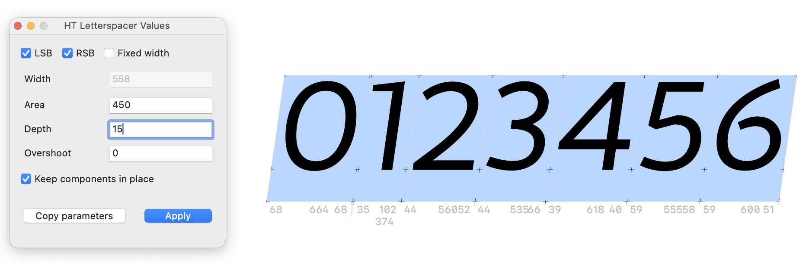
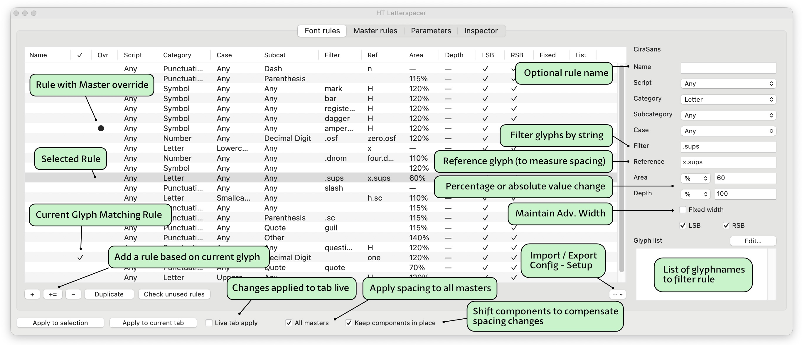
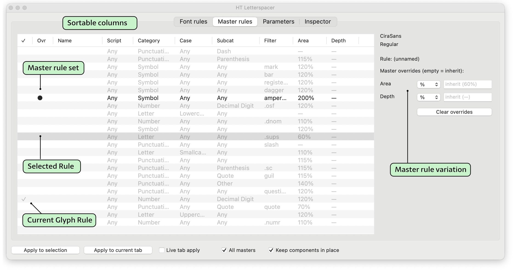
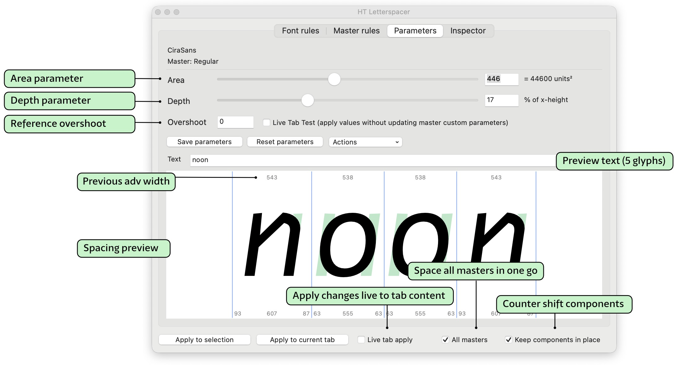
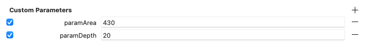
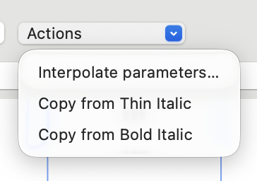
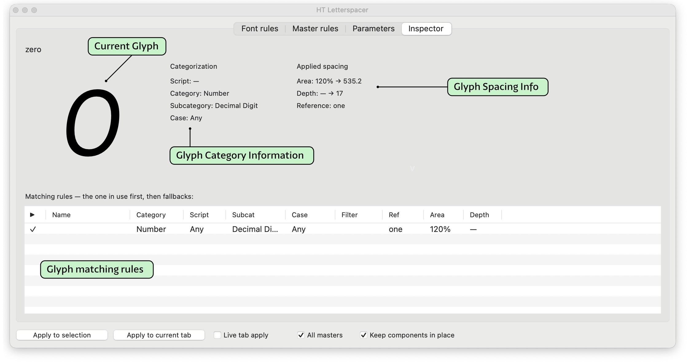
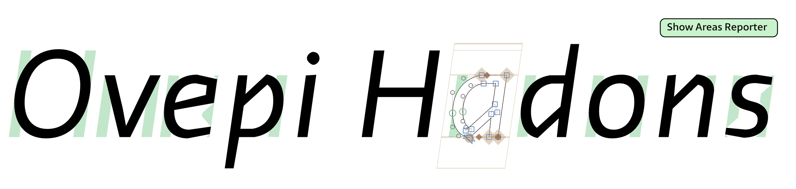
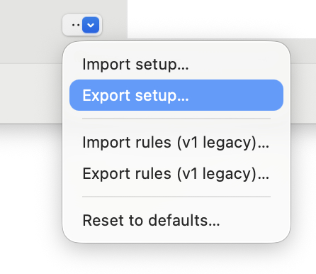

# HT Letterspacer

HT Letterspacer is a tool for spacing fonts, that works on finished fonts as well as during development. It spaces each glyph by the visual white area around it rather than by fixed side-bearing tables, so a single configuration keeps a family evenly spaced as it grows.

Version 2.0 rebuilds the tool as a native **Glyphs 3 plugin** with a full management UI. Spacing rules now live inside the font, are edited in a dedicated window, and can be previewed live in the edit view. The spacing method itself is unchanged — only the way you drive it.
The new plugin UI is partly inspired by the valuable work of [Sebastian Carewe](https://www.sebastiancarewe.com/) on the HTLS Manager plugin and reporter.


### [Visit the project homepage](https://letterspacer.htfonts.com)

> ⚠️ **Back up your fonts and configs first.** If you have existing spacing setups — legacy sidecar `.py` / `.yml` config files, or rules stored by eweracs’ HTLSManager — **make a backup of your `.glyphs` files and those config files before running the scripts on your fonts, importing rules, or otherwise applying the new tool.** This is a new, independent tool: importing old rules and running the new engine should but may not reproduce your previous results exactly (categories, parameters and the spacing math have all evolved), and migrating HTLSManager data into the new in-font storage is a one-way step. Keep a copy so you can always compare against, or revert to, your current spacing.

## Installation

HT Letterspacer ships as two Glyphs bundles — the main plugin and a reporter — plus an optional folder of helper scripts. Each is installed independently.

**Requirements:** Glyphs 3 with Python support enabled (install the Python module from *Window ▸ Plugin Manager ▸ Modules* if you haven’t already). After installing any of the parts below, **restart Glyphs** — plugin and reporter code is loaded at launch.

> 💡 **Assign keyboard shortcuts.** Once everything is installed, it’s well worth giving the plugin window, the reporter toggle and the scripts their own shortcuts so you can space without leaving the keyboard. macOS does this per-app, no extra software needed: open *System Settings ▸ Keyboard ▸ Keyboard Shortcuts… ▸ App Shortcuts*, click **+**, choose **Glyphs 3**, and type the **exact** menu title you want to bind:
>
> - **HT Letterspacer** (the *Glyph* menu — opens the plugin)
> - **Show HT Letterspacer Areas** (the *View* menu — toggles the reporter; use the title as it appears in your Glyphs)
> - **Apply HTLS Config** and **Apply HTLS Values** (the *Scripts* menu items)
>
> Pick shortcuts that don’t clash with existing Glyphs commands. The script titles must match the menu names exactly (including the *HT Letterspacer Scripts* submenu, which macOS ignores — only the final item name matters).

### 1. The plugin

**HTLetterspacer.glyphsPlugin** — the main plugin window (menu *HT Letterspacer*, in the *Glyph* menu).

Double-click it and Glyphs will offer to install it. (Or copy the bundle into the plugins folder at *Glyphs ▸ Settings ▸ Addons ▸ open the Plugins folder*.)

### 2. The reporter

**HTLetterspacerPreview.glyphsReporter** — the live “Show areas” overlay, toggled from the **View** menu.

Double-click it the same way (or copy it into the same plugins folder). The reporter is optional — the plugin works without it — but it provides the visual area preview.

### 3. The helper scripts *(optional but recommended)*

The **HT Letterspacer Scripts** folder holds two aux scripts that share the same engine and font rules as the plugin — for users who prefer to space from the keyboard instead of the window, or who just want to run the spacing config without opening the UI at all. Once the folder is in your Glyphs *Scripts* folder, the scripts appear together under the **Scripts ▸ HT Letterspacer Scripts** submenu.

Open the Scripts folder via *Scripts ▸ Open Scripts Folder*, then either:

- **Copy** the **HT Letterspacer Scripts** folder into it, or
- **Symlink** it instead of copying — handy when working from this repo, so the scripts stay in sync with the source. The easiest way is in **Finder**: drag the **HT Letterspacer Scripts** folder onto the open Scripts folder while holding <kbd>⌘ Command</kbd> + <kbd>⌥ Option</kbd> — this drops an *alias* (which Glyphs follows) instead of moving or copying the folder. Or do it from the Terminal:
  ```sh
  ln -s "/path/to/HTLS/HT Letterspacer Scripts" "~/Library/Application Support/Glyphs 3/Scripts/"
  ```

Then reload the Scripts menu (hold <kbd>Option</kbd> while opening the **Scripts** menu, or restart Glyphs).

The two scripts:

- **Apply HTLS Config** — spaces the current selection using the rules stored in the font, with no UI. Select some glyphs (or open a tab) and run it from the submenu; it writes the computed sidebearings and prints a short report to the Macro panel. This is the headless equivalent of the Parameters tab’s **Apply to selection**.
- **Apply HTLS Values** — a floating window to apply specific manual values (Area / Depth / Overshoot / LSB / RSB / fixed width) to the selection, independent of the stored rules. Each selected glyph is spaced against itself using the values you type; **Fixed width** keeps the advance width fixed, and an unchecked **LSB**/**RSB** leaves that side untouched. **Keep components in place** behaves as in the plugin, and **Copy parameters** puts an Area/Depth/Overshoot master-custom-parameter snippet on the clipboard. The window remembers its last-used values.

  

## Usage

Open the plugin from the **Glyph** menu (*HT Letterspacer*). The window has four tabs — **Font rules**, **Master rules**, **Parameters** and **Inspector** — over a shared footer of spacing actions that applies to whichever tab is showing.

### Font rules

The spacing rules stored in the font. Each row is a rule; selecting one opens its full editor on the right, and the (sortable) columns summarise it. The toolbar adds a blank rule (`+`), seeds a rule from the current selection (`+=`), removes (`−`), duplicates, and an `⋯` menu handles import/export (setup or legacy rules) and **Reset to defaults** — see [Sharing a configuration between fonts](#sharing-a-configuration-between-fonts). The ✓ column marks the rule matching the selected glyph; the **Ovr** column marks rules that carry a master override.



#### Rule fields

A rule has two kinds of fields: ones that decide **which glyphs it matches**, and ones that decide **what spacing it applies**. When more than one rule matches a glyph, the most specific one wins.

**Matching**

- **Script / Category / Subcategory / Case** — Glyphs’ own glyph classification (e.g. *latin* / *Letter* / *Lowercase* / *smallCaps*). Each is a pop-up; **Any** means “don’t constrain on this field”. A rule with everything set to Any matches every glyph and acts as the default.
- **Filter** — a comma-separated list of **name fragments**. The rule matches when the glyph’s name *contains* any one of them (substring, not exact). For example `.tf, .tosf` catches the tabular-figure suffixes, and `.sc` catches small-cap variants. Leave it empty for no name constraint.
- **Glyph list** — an explicit list of glyph names (one per line or comma-separated). When it is non-empty the rule applies **only** to those glyphs, ignoring the script/category matching above — a hard, targeted override for a handful of glyphs.

**Spacing**

- **Area** — the target amount of white space on each side, the main spacing control. As a **percentage** it scales the master’s base *Area* parameter (e.g. `125%` = 25% looser than the master’s default); as an **absolute** value it sets the white area directly in thousand-units, ignoring the master parameter. Higher = more space.
- **Depth** — how far into open counters (the sides of *c*, *e*, *r*…) the measurement is allowed to reach, again as a percentage of the master’s *Depth* parameter or an absolute value. It keeps deep open shapes from being pulled in too tight.
- **Reference (Ref)** — the glyph whose vertical range is used as the measuring zone. Empty = each glyph measures against **its own** height. Setting a reference such as `H` makes a group of glyphs space against the cap zone, so related glyphs stay consistent regardless of their own extremes.
- **LSB / RSB** — which side bearings the rule is allowed to write. Both are on by default; switching one off leaves that side’s **current** value untouched — useful when you only want to retouch one side.
- **Fixed width** — keep the glyph’s advance width constant. The computed spacing is distributed *inside* the existing width instead of changing it (for tabular figures and other fixed-advance glyphs).

### Master rules

Per-master overrides of a rule’s **Area** and/or **Depth** — for when one master needs different spacing from the family default. Pick a rule, then set an Area and/or Depth override for the current master; leave a field empty to **inherit** the font rule (the placeholder shows the inherited value), and **Clear overrides** removes them. The list uses the same sortable columns as Font rules, with the **●** column marking rules that carry an override on this master.



### Parameters

The current master’s base spacing parameters — **Area** (shown as the raw value and in units²), **Depth** (as a % of the x-height) and **Overshoot** — as sliders and fields, with a live **spacing preview** below. Type any text in the **Text** field to see those glyphs spaced with the current values, with the previous advance width shown above each for comparison. **Save parameters** writes the values to the master (as `paramArea` / `paramDepth` / `paramOver` custom parameters); **Reset parameters** reverts to the saved values; **Live Tab Test** applies the working values to the current Edit tab *without* saving them to the master, so you can audition a change non-destructively.



These values are stored as ordinary **master custom parameters** — `paramArea`, `paramDepth` and `paramOver` (*Font Info ▸ Masters ▸ Custom Parameters*) — so you can also see and edit them there directly, or copy them between masters.



The **Actions** menu helps to copy parameters from another master or interpolate them:



- **Interpolate parameters…** — set the current master’s Area/Depth/Overshoot by interpolating between two other masters, using the current master’s position on a chosen axis. Handy for filling in the in-between masters once the extremes are dialled in (needs at least two other masters and an axis).
- **Copy from \<Master\>** — one item per other master; copies that master’s parameters onto the current one.

### Inspector

A read-only readout for the currently selected glyph — handy for understanding *why* it is spaced the way it is. It shows the glyph’s **categorization** (script, category, subcategory, case), the **applied spacing** (the resolved Area and Depth — the percentage and the value it works out to — plus the reference glyph), and a **Matching rules** table listing every rule that matches the glyph: the one actually in use first (marked ✓), then the fallbacks in priority order.



### Applying spacing

The controls along the window footer decide **what** gets spaced and **when**:

- **Apply to selection** — space the glyphs currently selected (in the Font view or an Edit tab) once, now. The computed sidebearings — or, for fixed-width rules, the placement inside a fixed advance width — are written to those layers.
- **Apply to current tab** — the same, but for every glyph shown in the current Edit view.
- **Live tab apply** — when checked, **every change you make to a rule or a parameter immediately re-spaces the whole current tab**, so you see the effect as you edit. This is a fast feedback loop for dialling in values against real text.
- **All masters** — when checked, every apply (selection, tab, or live) is expanded to **all of each glyph’s masters**, not just the current one — so a single action spaces the whole family. With it off, only the current master is touched.
- **Keep components in place** — when checked (the default), re-spacing a glyph that is used as a component elsewhere does **not** move the composites that use it. As a base glyph’s sidebearing shifts, every manually positioned component referencing it is shifted back by the same amount, so accented letters and other composites stay put. See [Keeping components in place](#keeping-components-in-place) below.

> ⚠️ **“Live tab apply” writes to your glyphs.** Unlike the *Show areas* preview, it is **destructive**: each edit commits new sidebearings to every glyph in the tab. Keep an open tab as your working set, and turn it off when you’re done tuning. (Adding, duplicating or removing a rule while it’s on is blocked — changing the rule set would re-space the whole tab unexpectedly. Uncheck it first, then make the change.)

### Show areas (the reporter)

Enable the *HT Letterspacer Areas* reporter from the **View** menu (or bind it to a shortcut) to draw each glyph’s calculated white area as a non-destructive overlay — on both the active and inactive glyphs — so you can judge spacing visually without writing anything to the font.



> 💡 **Mind the load on large glyph sets.** The *Show areas* reporter, *Live tab apply*, *All masters* and *Keep components in place* each recompute spacing continuously or in bulk — the reporter redraws every glyph in view as you move, live apply re-spaces the tab on each keystroke, All masters multiplies the work by the number of masters, and Keep components in place scans the font for referencing components. On a long Edit tab or a many-master family this can get processor-intensive and sluggish. Use them at your discretion: a few glyphs at a time when tuning, and turn them off for bulk runs.

### Keeping components in place

A spaced glyph is often reused as a **component** in other glyphs — *a* in *à*, *ã*, *â*, *ª*; *o* in *ó*, *ø*; and so on. When you re-space such a base glyph its outline shifts relative to the origin, which would drag every composite that uses it out of position.

With **Keep components in place** on (the default), the engine prevents that:

1. **Bases first.** Glyphs that are used as components are spaced before the composites that use them.
2. **Shift back.** As each base is spaced, the change in its left sidebearing is measured, and every *manually positioned* component that references it — anywhere in the font — is shifted by the same amount in the opposite direction, so the composite stays exactly where it was.
3. **Then composites.** Composites that are themselves in your selection are spaced normally afterwards, reflecting the new base spacing.

Notes:

- **Auto-aligned components are left alone.** Glyphs already repositions them relative to their base (this is how most accented letters are built), so they need no compensation — only components with *Disable Automatic Alignment* set are shifted.
- The compensation is **font-wide**: composites that keep a base in place are adjusted even if they aren’t in your selection, which is what keeps the rest of the family consistent.
- The same option is available in the **Apply HTLS Config** and **Apply HTLS Values** helper scripts (on by default).
- Turn it off if you *want* composites to follow their bases, or to save processing on very large fonts.

### Sharing a configuration between fonts

The font is the single source of truth at run time — spacing always reads the rules and parameters stored in the font itself, never a file on disk. Files are import/export only: a portable container for transferring and backing up a configuration, *not* a sidecar that is read while spacing. The Font-rules **`⋯`** menu offers two pairs:



- **Import setup… / Export setup…** — the recommended format: a **`.json`** file (proposed name `<Family>_HTLS.json`) carrying the **whole setup** — every rule *plus* the per-master Area/Depth/Overshoot parameters and the per-master overrides. Use this to copy a complete configuration from one font to another.
- **Import rules (v1 legacy)… / Export rules (v1 legacy)…** — the old comma-separated `.yml` / `.py` format (proposed name `<Family>_autospace.yml`), for interchange with the original script and HTLSManager. It carries **rules only** — no parameters or overrides, and percentage-area only (absolute Area and Depth aren’t representable), so it is lossy; prefer **setup** unless you specifically need the legacy format.
- **Reset to defaults…** — replaces the font’s rules with the built-in starter set (with a confirmation).

### Migrating from the script sidecar .py/.yml or from HTLS Manager

Existing legacy `_autospace.yml` configs (and the older `.py` files) import directly through **⋯ ▸ Import rules (v1 legacy)**. Fonts previously spaced with eweracs’ HTLSManager are migrated to the new in-font storage automatically the first time you save.


## Change Log

Version 2.0 — Glyphs 3 plugin (beta)
- Complete rewrite as a native Glyphs 3 plugin (two bundles: the plugin plus an areas-preview reporter), replacing the macro/script workflow
- Spacing rules are stored inside the font (font and master userData) and edited in a tabbed window — no sidecar config file is read at run time
- The old single “factor” is split into independent **Area** and **Depth**, each settable as an absolute value or a percentage of the master parameters
- New per-rule options: **Fixed width** (keep the advance width fixed), **LSB/RSB** side toggles, **glyph list**, custom reference glyph, and rule names
- **Keep components in place** (footer toggle + helper-script option, on by default): re-spacing a glyph used as a component shifts its referencing components back so composites stay put; auto-aligned components are left to Glyphs
- **Master rules** tab for per-master Area/Depth overrides (an empty field inherits the font rule)
- **Parameters** tab to edit the master Area/Depth/Overshoot and Apply to selection
- Live, non-destructive **Show areas** overlay (reporter), for active and inactive glyphs
- Import/export the whole **setup** (rules **and** per-master parameters and overrides) as a `.json` file, to transfer or back up a configuration between fonts (a portable container, not a sidecar read while spacing)
- Still imports **and** exports the legacy comma-separated `.yml` / `.py` rules format, and migrates eweracs’ HTLSManager font data automatically
- Faithful port of the original spacing engine, parity-tested against the script (including italic, tabular and stroked glyphs)
- Helper scripts: **Apply HTLS Config** (space the selection from the font rules, no UI) and **Apply HTLS Values** (a window for manual Area/Depth/Overshoot/LSB/RSB/fixed-width values)

Version 1.20
- Improve code simplicity and syntax by Nikolaus and Georg
- Add Glyphs 3 compatibility
- Improve diagonize and drawing calculations
- Fix bugs with reference zones
- Improve performance with less measurements
- Restore original configuration for both G2 and G3
- Change default config files to .yml extension (same format and syntax)

Version 1.11
- Code merged in one script file
- createProofGlyph renamed to drawAreas
- Fixed bug with empty tabular field
- parameters can be float, tabular value is integer

Version 1.10
- Copy parameters to clipboard (thanks mekkablue)
- Robofab no longer required for drawing _areas
- No more code repetition
