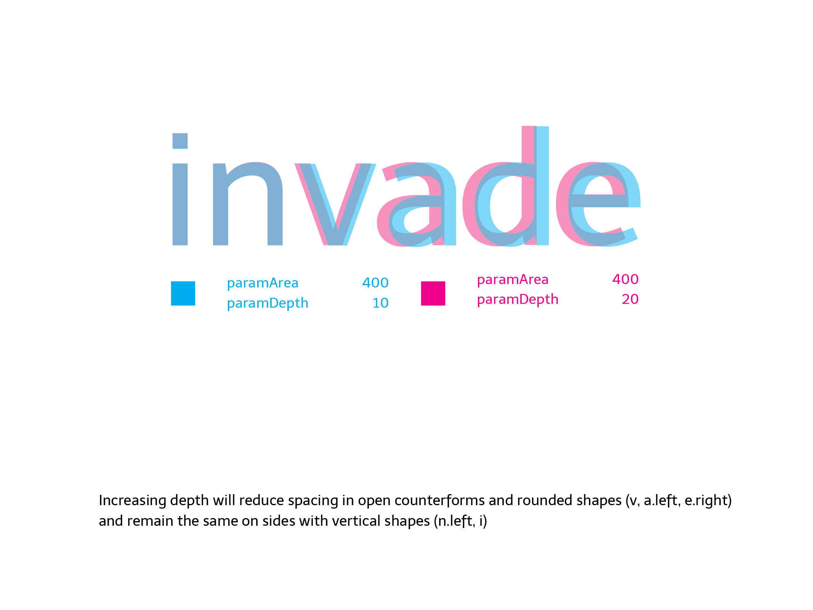

# Huerta Tipográfica LetterSpacer

LetterSpacer is a tool for spacing fonts, that works on finished fonts as well as during development. 
The first public version works as a macro for [Glyphs](https://glyphsapp.com) and uses that application's glyph categories and subcategories feature, but the method is adaptable to any editor or programming language.

With LetterSpacer making a consistent spacing is easy, because you can define fixed parameters of spacing during your type design process and focus on the letterform drawing. 

By making the spacing of a font simpler you can try different spacing options quickly without going mad. 

Today LetterSpacer doesn't kern, it is only for setting glyph widths and sidebearings.

### So it replaces the type designer's craft?

No. 
You have to configure and use it in what you think is the best way. 
You still need to know what you are doing. 
The default configuration will output a reasonable result for a beginner, but it does not replace the eye of a master type designer. 
To achieve an excellent spacing you need to make an excellent configuration and use of the script. 
But having good results will be easier and faster.

### What are the ideas behind it?

LetterSpacer is a method for define sidebearings based on the amount of white space or area in a glyph box, and define a way to measure it, using 3 parameters for each master. 
The parameters are set up for lowercase letters and modified by a configuration template to different groups of letters (using the glyph categories in Glyphs.)
There is a script version with a window, where you can apply specific parameters to selected glyphs. 
The area entered, the zone measured and the depth from each glyph sides will be equalized for all the glyphs in a group.

You can use the script based on a template where each category of glyphs has a number that changes the area parameter proportionally, to do a general spacing that looks good. 
Otherwise you can work applying specific parameters manually to different groups of glyphs, on the fly. 
The more you put your eye and hand on the process, the more accurate are the results. 
LetterSpacer allows you to work on groups of glyphs reducing the time and effort for achieve a consistent spacing. 

It works with big families and many masters. 
If you've changed your mind late in the process, or you want to adapt your fonts to a new purpose, then redesigning the spacing scheme of the entire typeface family is easy. 
The results can be mixed with your type designer eye as much as you wish.

With LetterSpacer it is possible to work on tabular or fixed width glyph groups (like tabular numbers) too, on a case by case basis. 
For monospaced fonts you can set the script to a global tabular mode. 

LetterSpacer is a tool for type designers. 
There are no magic parameters and each designer can make their own experiments to achieve different results and find their own way to use it for different purposes. 
Spacing a font is a matter of design, where the designer must make many decisions based on the proportions of letters, the general look, the role of tabular glyphs, and many other factors. 

We want this tool to be open and free to the community, to receive feedback and improvements made by other designers.

### Can I see it in action?

Here is a screen-recording, applying the tool to two fonts:

[youtu.be/playlist?list=PLosdR3A2AyETyiOZWH2A6d_lwWke7zxaQ](https://www.youtube.com/playlist?list=PLosdR3A2AyETyiOZWH2A6d_lwWke7zxaQ) 

Explanation of how to use it:

[youtu.be/jxntU6c70-s](https://www.youtube.com/watch?v=jxntU6c70-s)

### Can I see example fonts spaced with the tool?

The [Telder HT Pro](http://www.huertatipografica.com/uploads/pdf/telder-ht-pro.pdf) family's spacing was made with the tool around 98%, plus a little 2% of post-adjustment. 
The family was drawn in parallel with the development of the tool.

### What do I need to set up to use it?

For using the script you need two main things:

1. Declare custom parameters on each master of your Glyphs file or a general default one in the script code. 

2. A configuration file in the same folder than your Glyphs file, named like yourfontname_autospace.py, with all the glyph categories, they area value and glyph of reference to define the vertical range where the group will be measured. 
If there is no file in the same folder, or with incompatible name, you will get an error.

### Parameters

Parameters are declared in the master parameters field, in the font info.

If the master doesn't have the appropriate custom parameters or the parameter name is different as required, the script will use the default values on the source code. 
Check example files to see it configured.

Once the script is executed it will output the results in the macro window, telling you if it is using the custom parameters or default parameters. 

The `paramArea` parameter lets you define how much area (measured in thousand units) do you want between the lowercase letters inside the x-height. 
A font suitable for text at 1000 UPM typically uses a value between 200 and 400.

The `paramDepth` parameter (measured relatively as a % of x-height) lets you define how deep into open counterforms you want to measure the space, from the extreme points of each glyphs to its center. 
This parameter will affect rounded or open shapes. 
For example: a square with x-height has no depth, its side is vertical, and this value won't affect it. 

But a triangle with x-height (a circle, a c-shape or a T) has a long distance and amount of white from its extreme points or sides to the center of the letter. 
Our eyes doesn't pay attention to the whole area, so the program doesn't do it either. 
But you need to decide how much of this "big white" you want to measure setting up this parameter.

Depending on the design, this value moves between 10 or 25 (percent of x-height).

The `paramOvershoot` parameter expands the vertical range or height where you measure the space, above and below the shape, by a certain % of x-height. 
It allows you to make slight differences when a sign has outlines exceeding the height on its group of letters, typically ascenders or descenders. 
For example: in a sans serif font, a dotless /i/ and and /l/ could have exactly the same shape between the baseline and x-height line. 
Setting up an overshot will expand the range up and down and will result in a different calculation of space for each sign. 
In this case, the sign with ascenders (the /l/) will result on a looser space, and its difference depends on how much the overshot is.

This parameter is optional and depends on what do you want to do with it, but is intended to be used similar to an overshot

### Configuration file

A text file in the same Glyphs file folder will define all the different alterations for each category of signs, as well as a reference sign which defines the height or vertical range of the signs group. 
For example: lowercase vertical range could be defined with `x`, uppercase with `X` or `H`, small caps with `x.sc`, numbers with `one`, etc.

Config values and rules

Each line of the configuration files will contain a set of rules to apply to a group of glyphs. 
Lines should be ordered from general to specific rules. 
Each field in this line should be separated by comma, with a trailing comma:

    Script, Category, Subcategory, value, reference glyph, name filter,

| Item | Description |
|------|-------------|
| Script | The name of the script type. Asterisk `*` means all |
| Category | The name of the Glyph category. For the lowercase glyphs is Letter |
| Subcategory | The name of the Glyph subcategory. For the lowercase glyphs is Lowercase |
| Value | The number or coefficient of variation that changes the area parameter in each category or rule. In this case the area parameter will be maintained multiplied by 1. If you set up a paramArea of 400 and this value is equal to 2, it means that the area applied will be 800. In this version of script only area parameter is altered by this number. |
| Reference glyph | It's the name of the glyph that defines the vertical range or area where spacing will be measured. For lowercase we will use the `x`, but you can use any other glyph with the same height, lower and higher points. (Note: it seems silly to define this if we have values as x-height or caps height on the font. But it is made in this way to make it open to any other group of glyphs without standard values on the font, like small caps, numbers, superscript, devanagari, etc.) |
| Filter | You can filter the rules by any suffix or part of the glyph name. `*` means `all`. But, for example, you can constrain the rule just to the ordinal glyphs writing `ord` in this rule. So it will be applied to `ordfeminine`, `ordmasculine` and `mordor`, if you have this last one. |

A simple example of the first 4 lines of a config file for a given font:

    *,Letter,Uppercase,1.5,H,*,
    *,Letter,Smallcaps,1.25,h.sc,*,
    *,Letter,Lowercase,1,x,*,
    *,Letter,Superscript,0.7,ordfeminine,*,

A [default config file](config-default.py) is provided to make the process easier. You must rename this file so it has the same name as your font plus the "_autospace" suffix. For example if your file is called "myserif.glyphs" your config file should be renamed to "myserif_autospace.py".

You can activate or deactivate lines writing a numbersign at the beginning of the line, just as it is in Python language. 
Each line should contain the 6 values separated by comma, otherwise will result in a traceback error or misconfiguration.

Once the script is executed on a selection of glyphs, it will output the results in the macro window, displaying if it is using the custom parameters or default parameters and which line of config was applied in each glyph. 
In this way, you can have control of what the script is doing and if it is applying the line you want.

If a glyph doesn't match any line, the area parameter will be applied and multiplied proportionally to the glyph height.

### Working with UI
If you want to work with an window to set the values for different selection and override default or custom parameters, just set `window=True`.
You can also put a copy of the main script in your Scripts folder with the window activated and a different name on the first line, and asign two different shortcuts on your OS to each script to use them wisely and quickly.

### Tabular glyphs and fixed-width fonts
If you want to work with fixed-width fonts, you need to hardcode the script library and set it as `self.tabVersion = True`.
If you need to apply tabular values to specific selection of scripts, you can check the Tabular box and enter an advanced width value in the UI. Very useful for figures, math or punctuation.

### Visualizing area
To visualize the result area of your paramters in a specific glyph, turn on `createProofGlyph = False` on the script first lines. After this you will have glyph named `areas` with an outline representation of both sides of the box, and it will be updated every time the script runs over one specific glyph.
This function needs robofab installed.

### Project History

Andrés Torresi is the initial and primary author of this tool. 
Soon after joining the postgraduate course in typeface design in Buenos Aires in 2009 he began research to find a simple and semi-automated method to set glyph sidebearings, that could work at any moment during a project, and that the type designer can control. 
Today LetterSpacer is the result of this research, and has been thoroughly tested by Andrés and Juan Pablo del Peral at the Huerta Tipográfica foundry and other designers on Latin, Greek, Cyrillic, and Devanagari designs. 
Experiments with Latin fonts by several other type designers around the world were conducted during development, and each said that the LetterSpacer program produces great results.

At the ATypI 2015 in São Paulo, Andrés approached Dave Crossland to discuss ways of funding the project to make it available under the GPLv3 license. 
Andrés wanted to invite other type designers and software developers to use, study, share, and improve the tool, because with peer review it can grow beyond what he can do by himself and become a basis for better and new approaches to font spacing. 
The tool was used and tested privately by the Google Fonts team and finally at ATypI 2016 in Warsaw Andrés and Georg Seifert announced that LetterSpacer is finally available for all Glyphs users from the Glyphs Plugin System with sources at [github.com/huertatipografia/ht-](https://github.com/huertatipografia/ht-spacer)[letter](https://github.com/huertatipografia/ht-spacer)[spacer](https://github.com/huertatipografia/ht-spacer)
